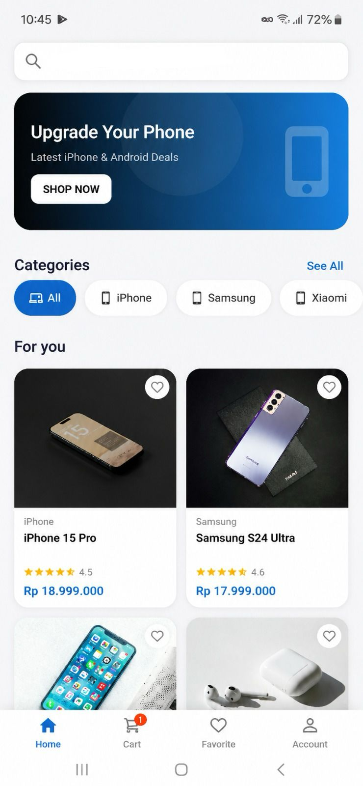

# 🛒 Shopping Tangerang
---

## 👨‍🎓 Informasi Mahasiswa

| Keterangan | Detail |
|------------|--------|
| **Nama** | **Wahyu Slamet Adi Triyono** |
| **NIM** | **1125170131** |

---

# 📱 Tampilan Aplikasi

## 1. Login

Halaman login digunakan oleh pengguna untuk masuk ke dalam aplikasi menggunakan email dan password yang telah terdaftar.

  

**Fitur:**
- Login menggunakan email dan password
- Validasi data login
- Redirect ke halaman utama

---

## 2. Register

Halaman registrasi digunakan untuk membuat akun pengguna baru.

  

**Fitur:**
- Registrasi akun
- Validasi input
- Penyimpanan data pengguna

---

## 3. Home

Halaman utama menampilkan seluruh produk yang tersedia pada sistem.

  

**Fitur:**
- Menampilkan daftar produk
- Pencarian produk
- Kategori produk
- Akses ke halaman detail produk

---

## 4. Detail Product

Menampilkan informasi lengkap mengenai produk yang dipilih oleh pengguna.

  

**Fitur:**
- Foto produk
- Nama produk
- Harga
- Deskripsi produk
- Tambah ke keranjang

---

## 5. Cart

Menampilkan daftar produk yang telah dipilih pengguna sebelum melakukan checkout.

  

**Fitur:**
- Menampilkan isi keranjang
- Mengubah jumlah produk
- Menghapus produk
- Menghitung total belanja

---

## 6. Checkout

Halaman untuk menyelesaikan proses transaksi pembelian.

  

**Fitur:**
- Data penerima
- Ringkasan pesanan
- Total pembayaran
- Konfirmasi checkout

---

## 7. Account

Halaman profil pengguna yang berisi informasi akun.

  

**Fitur:**
- Melihat data akun
- Logout

---
